<h1>
  <picture>
    <source media="(prefers-color-scheme: dark)" srcset="media/logo/agenttrace-lockup-dark.svg">
    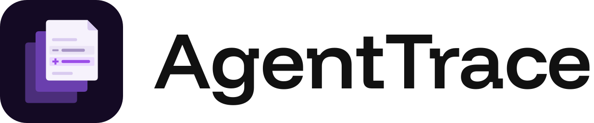
  </picture>
</h1>

[](https://github.com/VamP08/AgentTrace/actions/workflows/ci.yml)
[](LICENSE)
[](https://www.npmjs.com/package/@vamp08/agenttrace)

A local web app that shows a Claude Code session as it happens, and explains it. For the person
who hands a coding agent an hour of work and wants to know, afterwards, what it did, what it
changed, and why.

**Live preview:** <https://agenttrace-preview.onrender.com> (a static build on made-up demo data, so nothing you do there is saved)

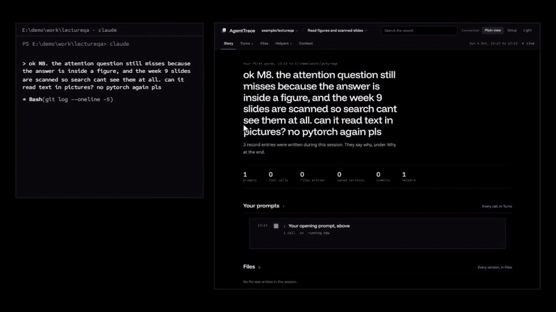

<sub>The demo's last session playing in with `npx @vamp08/agenttrace --demo --live`. The left pane is that session's transcript lines drawn as the terminal would print them; the right is the app, captured as it ran.</sub>

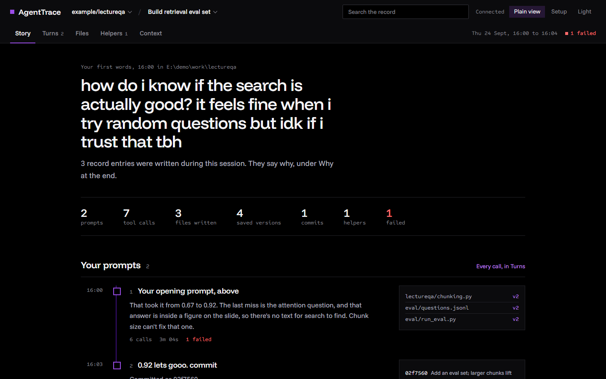

It reads the transcript files Claude Code already writes to disk, tails them live, and renders
each session as turns: what you asked, what the model did in answer, every tool call with a
plain-language line the first time that tool appears, the files that changed with a diff for
every version, the helpers that were spawned with their briefs and reports, and what each turn
cost in tokens. No model runs inside the app. Everything it explains was written down at build
time, by hand or by the coding session itself through a skill.

The screenshots and the preview are of the built-in demo, not of anyone's real work:
**LectureQA**, a student's app that answers questions from their lecture PDFs and cites the page,
built over eleven sessions across three weeks, plus one exam question asked outside the project. It
has what real sessions have: a page that could not reach its API, a 2.6 GB download stopped
halfway, helpers sent to investigate, failing tests, a made-up answer caught, a prompt injection
from a shared PDF, a cache bug its own test found, and scanned slides read with OCR. Its record teaches what the build ran into:
chunking, embeddings, cosine similarity, recall@k, grounded answers, prompt injection, cache keys.

| | |
|---|---|
| 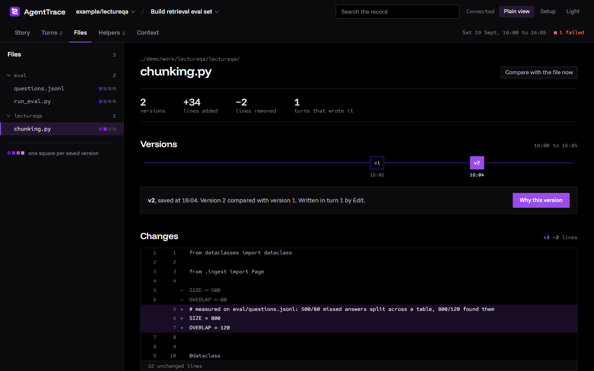 | 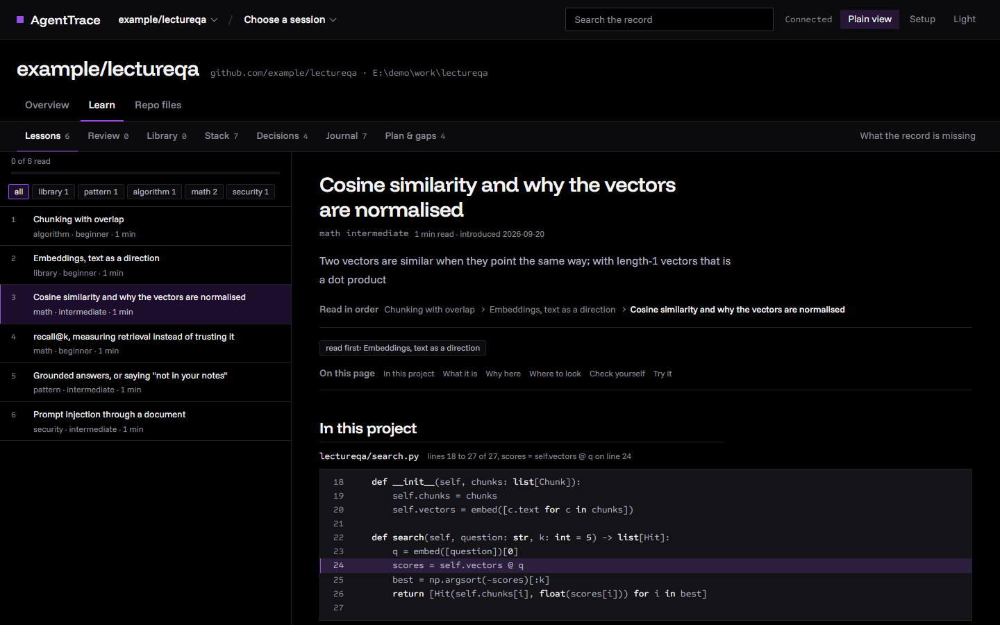 |
| 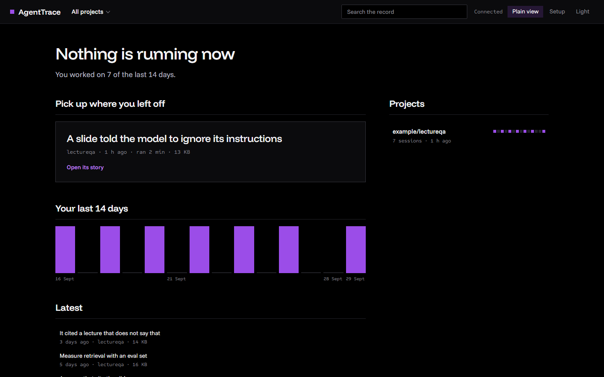 | 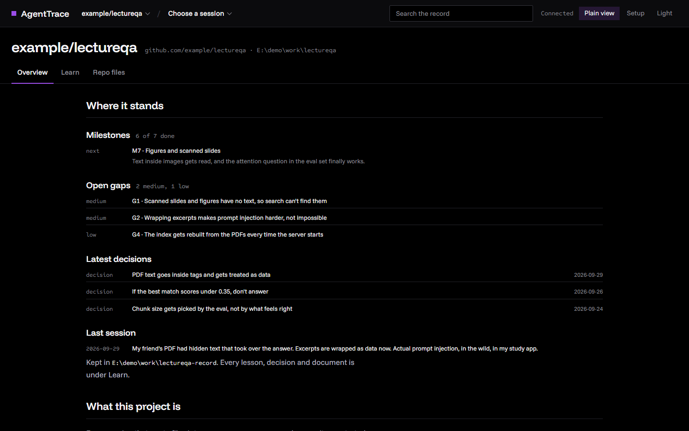 |

On a phone:

<p>
  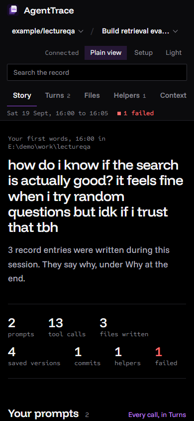
  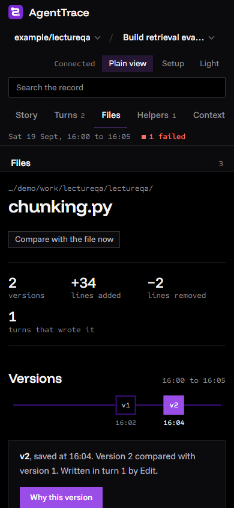
  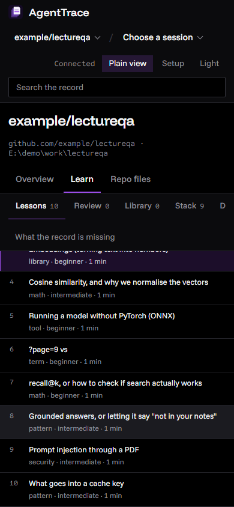
</p>

## How it works

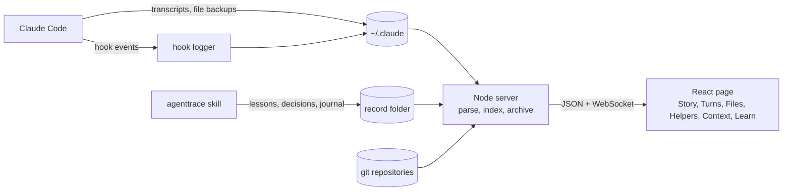

One Node process reads the files Claude Code already writes, turns each transcript line into a typed
event, joins file backups, git commits, hook timings and the learning record onto the same timeline,
and streams it to the page over a WebSocket. Nothing is stored except an archive copy of each session
(so the tool's own cleanup doesn't delete your history) and a progress file for the review deck.

## Why this instead of…

- **Reading the transcript files yourself.** They are one JSON object per line, thousands of lines
  per session, with tool inputs and results inline. AgentTrace turns them into turns, diffs and a
  story, and joins in what the transcript doesn't hold: file versions, commits, hook timings.
- **Token and cost trackers** (ccusage and similar). They answer how much a session cost.
  AgentTrace answers what it did and why; per-turn token use is one view of five.
- **LLM tracing platforms** (Langfuse, LangSmith). They trace an application you instrument, and
  usually send the traces to a service. AgentTrace needs no instrumentation and nothing leaves
  your machine.
- **Scrolling back in the terminal.** Shows the conversation, not the file versions, the helpers'
  own work, the commits, or a record you can learn from later.

## Decisions and trade-offs

- **No model at runtime.** Every explanation is written ahead of time, by hand or by the coding
  session through the skill. The app can't hallucinate a summary, and it can't write one either:
  the Story view is built only from what the files say.
- **The disk is the database.** No import step and nothing to keep in sync. The price is that
  every view is computed from files, which is why the server caches parses by size and mtime.
- **The transcript is the source of truth for commits.** Git history gets rewritten; a commit
  counts when the transcript shows it being made, and git only adds detail.
- **Plain view on by default.** Tool inputs and JSON results show as named fields; the raw JSON
  and unparsed records are one toggle away, never deleted.
- **The online preview is a static build.** The real server runs once at build time on the demo
  and every response is baked into the page, so the preview never sleeps and costs nothing to host.

## Measured

| What | Before | After |
|---|---|---|
| Event-loop stall on a warm restart with ~2,800 sessions (p99) | 24–53 s | 65 ms |
| Opening a project's learning record (1.26 MB) | 1.4–3.3 s | 0.27–0.53 s |
| Opening a long session's story (git lookup for its commits) | 4.6–5.3 s | 0.6 s |
| Search across 420 record entries | | 2–14 ms |

## What it reads

| Source | Where | What it gives |
|---|---|---|
| Transcripts | `~/.claude/projects/<project>/<session>.jsonl` | Turns, tool calls, results, token usage |
| Helper transcripts | `<session>/subagents/agent-*.jsonl` | Each helper's own work, joined to its brief |
| File history | `~/.claude/file-history/<session>/` | Every version of every file the session edited |
| Hook log | `~/.claude/agenttrace/hooks/<session>.jsonl` | Tool durations, permission requests, notifications (after installing the hooks) |
| Archive | `~/.claude/agenttrace/archive/` | AgentTrace's own copy of every session it has indexed, read once the coding tool's cleanup has removed the original |
| Git | the repositories the session touched | Commits made during the session, joined to turns by time |
| The record | a folder named by `agenttrace.json` | Concepts, decisions and journal entries the session wrote while building |

## Run it

Requires Node 20.19 or later, and git for the demo.

```
npx @vamp08/agenttrace          # your own Claude Code sessions, from ~/.claude
npx @vamp08/agenttrace --demo   # or the LectureQA demo, if you want to look first
```

Or from source:

```
git clone https://github.com/VamP08/AgentTrace.git
cd AgentTrace
npm install
npm run build
npm start          # your own Claude Code sessions, from ~/.claude
npm run demo       # or the LectureQA demo, if you want to look first
```

`npm start` starts the server and the page on one port, prints the URL and opens a browser.
`AGENTTRACE_PORT` moves it off 4747. `npm run demo` builds the demo under your temp folder, a
real git repository included, and opens the app on port 4750 with `CLAUDE_CONFIG_DIR` pointed at
it, so your own sessions are never read. It is written by `scripts/demo.mjs`, in the coding
tool's own file formats. Add `--live` (`npx @vamp08/agenttrace --demo --live`) and its last
session plays in line by line over about two minutes, so you can watch a session as it runs.

For development:

```
npm install
npm run dev
```

One command, both halves: the API and live stream on `http://127.0.0.1:4747`, and the page on
`http://localhost:4748` with Vite forwarding `/api` and `/ws` to the server. `AGENTTRACE_PORT` and
`AGENTTRACE_WEB_PORT` move either one; anything after `--` goes to Vite. Ctrl-C stops both, and if
either half exits the other is stopped with it.

The bar at the top says where you are: a project, then a session, each a menu with a filter. The
start page lists what is running and the latest sessions. Sessions that wrote into no repository,
and sessions a program started through the Agent SDK, are kept apart under the project menu.

The server binds to the loopback address only, sends no cross-origin headers, and refuses
requests whose Host is not localhost.

## Views

A session has five views and opens on the first:

- **Story.** The first prompt as the headline, the session's figures, then each prompt down a
  spine in order with the start of the reply and the files that turn wrote. Below that, the files
  rewritten most, the record entries written during the session, its commits and its helpers.
  Every sentence is read from the transcript, the backups, git or the record.
- **Turns.** While the session is live, a Now panel with the latest request, the model's latest
  line, and the running tool with its explanation; once it is over, a summary of the whole
  session instead. Below either, each turn as a chapter with counts, folded until opened.
  Commits made during a turn appear inside it.
- **Files.** Every file the session touched, as a folded tree, and for the open file its saved
  versions on the session's clock and the line diff between a version and the one before it, or
  between the last backup and the file on disk now. A version's call and the prompt that asked
  for it open in a side panel.
- **Helpers.** Each subagent with the brief it received, its transcript, and its report back.
- **Context.** Per turn: the size of the context the model saw, tokens written, replies, and
  everything that entered the context without you typing it.

Picking a project in the bar opens the project instead of a session, with three tabs:

- **Overview.** Where its record stands, what the repository is, the projects it shares sessions
  with, and its own sessions.
- **Learn.** The project's record as a learning path: lessons by type, a review deck that brings
  a lesson's questions back a week later, decisions, journal, and the record's own documents:
  roadmap, stack, architecture, design, gaps.
- **Repo files.** The documents the repository already keeps, read in place.

## The record

The Learn view depends on a folder of Markdown files with YAML frontmatter that a coding
session is instructed to keep. The format is defined in `skill/SKILL.md`. The Setup screen in
the app installs the skill, prints the `agenttrace.json` to place at a project's root, and the
paragraph to add to that project's `CLAUDE.md`.

The record sits beside whatever documentation a project already keeps and never replaces it:
the skill writes only inside the folder named in `agenttrace.json`, and puts the record in an
`agenttrace` subfolder when that folder already holds files with the same names.

A repository built before the record existed can be backfilled. `GET /api/dossier?cwd=<repo>`
returns a Markdown dossier of what the app knows about it: which evidence exists, the archived
sessions that worked there, the technologies seen, every commit on the default branch with the
session it belongs to, and the commit messages that state a reason. The skill's backfill
section turns that into a record, writes only the documents the evidence supports, and marks
each one `reconstructed`.

## Hooks

`hooks/install-settings.mjs` registers a small logger for thirteen Claude Code hook events and
wraps the status line command. It backs up `settings.json` first and prints the backup path.
The logger appends one JSON line per event to `~/.claude/agenttrace/hooks/<session>.jsonl` and
never blocks the session.

## Tests

```
npx vitest run --root server
```

Parser, discovery, tailer, file history, stack detection, record reader, document reader, hook
log, archive, project folding, dossier and git are covered.

`server/test/bench.ts` times the parser against a transcript you name; it takes a path and
prints milliseconds, event counts and peak heap. It is not part of the test run, and no
transcript ships with the repository.

```
npx tsx server/test/bench.ts ~/.claude/projects/<project>/<session>.jsonl
```

## Status

Built and used on Windows against real sessions. CI runs the tests, the build and the demo on
Windows, macOS and Linux; on macOS and Linux it has not yet been used against real sessions. The
status-line wrapper has not been confirmed from a terminal session. Published to npm as
`@vamp08/agenttrace`.

AgentTrace reads Claude Code's own files, whose format is not a published interface and can change
between releases. A line it doesn't understand is kept as a raw record, visible with Plain view off, rather than dropped; if a release
breaks something, an issue with the Claude Code version helps.

Plain view, on by default in the bar, shows a tool's input and any JSON result as named fields and
hides the raw transcript records; turn it off to see everything as the transcript holds it.

## License

MIT
