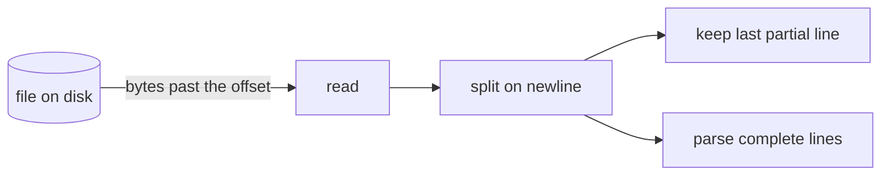
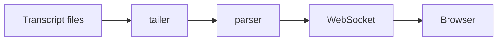

# AgentTrace record

AgentTrace reads a folder of Markdown files and turns them into a live, explained view of how a
project was built. It uses no language model of its own. Everything it can explain, it explains
because you wrote it down here, in the same turn as the code, in the format below.

Write for a reader who does not program. Short sentences. Name the thing, say what it does, say
why it is here, say what it replaced. Then, and only then, the mechanism.

## Where the record lives

The project's record root is named in `agenttrace.json` at the root of the project repo:

```json
{ "contract": 1, "project": "AgentTrace", "record": "e:/Work/Live/code/Project/docs/AgentTrace" }
```

If the file is missing, ask where the record should live before writing anything. Offer these
three, in this order, and say what each costs:

1. **Inside the repository**, at `agenttrace/`. The lessons travel with the code and are reviewed
   in the same pull request. Cost: they are public if the repository is public, so nothing
   sensitive can go in them.
2. **A sibling folder**, at `../<Project>-notes/`. Private by default, still next to the code.
   Cost: a second folder to back up, and it is easy to forget when the repository is cloned.
3. **One notes repository for every project**, at `<path>/<Project>/`. Everything in one place,
   versioned together, private. Cost: the notes live away from the code they describe.

Write the answer into `agenttrace.json` and continue. Never guess: the choice decides whether
these files can be published, and only the owner knows that.

Every path below is relative to `record`.

```
<record>/
  roadmap.md            milestones and their gates
  stack.md              every technology in use, with why and what was rejected
  architecture.md       components, how they connect, one diagram
  design.md             visual and interaction design choices (only for projects with a UI)
  gaps.md               known problems, never deleted, marked fixed in place
  learning/<slug>.md    one concept per file: the teaching material
  decisions/<slug>.md   one decision per file, ADR style
  journal/<date>.md     one entry per working session
```

Slugs are lowercase, hyphenated, unique within their folder. Check the folder before writing so a
concept gets one file, not two. If the concept already has a file, update it and bump `updated`.

## When to write what

| Moment | Write |
|---|---|
| A dependency is added, a config file for a tool appears, a new language or runtime is used | `stack.md` row, plus a `learning/` entry of type `library` or `tool` |
| A pattern is introduced (streaming a file, a state store, an event bus, virtualization) | `learning/` entry of type `pattern` |
| An algorithm or data structure is written by hand | `learning/` entry of type `algorithm`, with the steps written out |
| Math appears (a formula, a rate, a probability, a scoring rule) | `learning/` entry of type `math`, formula plus a worked example with real numbers |
| A component is created, split, merged or removed | `architecture.md` components list and diagram |
| A choice is made between two or more viable options | `decisions/` entry |
| A visual or interaction choice is made (layout, typography, color, motion) | `design.md` section, and a `learning/` entry of type `design` if the choice teaches something |
| A security or correctness boundary is set (validation, path checks, limits) | `learning/` entry of type `security` or `testing` |
| A problem is found and left unfixed | `gaps.md` row |
| A milestone gate is passed | `roadmap.md` status |
| The session ends, or the user says stop | `journal/<date>.md` |

Write the entry in the same turn as the code it describes. Do not batch to the end.

## learning/<slug>.md

A learning entry is a lesson, not a note. It opens on the reader's own code, shows the idea as a
picture, walks the mechanism in steps, asks the reader to commit to an answer before seeing it,
and ends with something to try. Aim for the length of a good tutorial page, not a paragraph.

```markdown
---
title: Tailing a file by byte offset
summary: Read only the bytes added since last time, so a growing file is never re-read
type: pattern
level: beginner
tags: [filesystem, streaming, chokidar]
files: [server/src/tail.ts]
anchor: onChange
prerequisites: [jsonl, line-by-line-file-reading]
related: [chokidar]
date: 2026-09-03T10:42:00+05:30
updated: 2026-09-03T10:42:00+05:30
session: 2700d89b-d5b8-44bd-bf70-c7673b150d57
questions:
  - q: The file is 1,000 bytes and the offset says 1,000. A change event fires and the file is 1,200 bytes. How many bytes are read?
    a: 200. Only the bytes past the offset. The offset then becomes 1,200.
  - q: The file shrinks to 300 bytes. What must the tailer do, and why?
    a: Reset the offset to zero and drop any partial line. A smaller file means it was replaced, so nothing already read can be trusted to still be there.
exercise:
  task: In a scratch folder, write a 20-line script that prints new lines of a file as they are appended, using only fs.statSync and fs.readSync.
  hint: Keep two variables between polls, the byte offset and the partial line without a newline yet.
  solution: |
    let offset = 0, partial = '';
    setInterval(() => {
      const size = fs.statSync(file).size;
      if (size < offset) { offset = 0; partial = ''; }
      if (size === offset) return;
      const buf = Buffer.alloc(size - offset);
      const fd = fs.openSync(file, 'r'); fs.readSync(fd, buf, 0, buf.length, offset); fs.closeSync(fd);
      offset = size;
      const lines = (partial + buf.toString()).split('
');
      partial = lines.pop() ?? '';
      lines.forEach((l) => console.log(l));
    }, 200);
---
## What it is

Two or three short paragraphs a non-programmer can follow. Say what the thing is, what it
replaces, and the one sentence that makes it click.

## Why here

The reason this project needs it, and what simpler thing would have failed. Name the cost.

## The idea in one picture



One sentence under the picture saying what to look at.

## How it works

1. Numbered steps, one action each, in the order the code does them.
2. For an algorithm, the steps are the algorithm.
3. For math, the formula, then one worked example with real numbers from this project.

## Where to look

File names and function names, so the reader can open the code. The app shows the lines
around `anchor` from the first file in `files` automatically; say what to notice in them.

## Go deeper

One or two links, or a book chapter, each with a line on why.
```

Fields:
- `type`: one of `library`, `tool`, `pattern`, `algorithm`, `math`, `architecture`, `design`,
  `security`, `testing`, `term`.
- `level`: `beginner`, `intermediate`, `advanced`. Judge for a reader who does not program.
- `summary`: one sentence, shown on cards. No trailing period needed.
- `tags`: lowercase words. Reuse tags already present in the folder.
- `files`: paths relative to the project repo. The first one is the lesson's code sample.
- `anchor`: a function, class, variable or exact phrase in the first file. The app shows the
  lines around its first occurrence. Omit only when the whole file is short.
- `prerequisites` and `related`: slugs of other entries. A prerequisite that has no file yet is
  a request to write it.
- `questions`: two to four. Each `q` is answerable from the lesson; each `a` says why, in one
  or two sentences. The reader commits to an answer before revealing yours.
- `exercise`: one `task` the reader can do in ten minutes with what is on this machine, one
  `hint`, one `solution`. The solution is real, runnable text, not a description.
- `date`: when first written. `updated`: when last changed. ISO 8601 with offset.
- `session`: the id of the session that wrote the entry. Read it with
  `echo $CLAUDE_CODE_SESSION_ID` in a Bash call; it is set in every session.

Body headings are exactly `## What it is`, `## Why here`, `## The idea in one picture`,
`## How it works`, `## Where to look`, `## Go deeper`. The app renders them as sections with a
table of contents. A `mermaid` fence draws a diagram; a code fence with a language name is
highlighted. Plain bullet and numbered lists, bold, inline code and links render; no HTML.

A `term` entry may stop after `## What it is` and `## Why here`, with one question and no
exercise. Everything else gets the full shape.

## decisions/<slug>.md

```markdown
---
title: No database; the transcript files are the source of truth
status: accepted
date: 2026-09-03T09:10:00+05:30
tags: [storage, architecture]
files: [server/src/discover.ts]
supersedes:
session: 2700d89b-d5b8-44bd-bf70-c7673b150d57
---
**Context.** What was true and what forced a choice.

**Options.** Each option in one line, with its cost.

**Decision.** The option taken.

**Why.** The reasons, in order of weight.

**Consequences.** What becomes easier, what becomes harder, what to revisit and when.
```

`status` is `accepted` or `superseded`. When superseding, write a new file, set `supersedes` to
the old slug, and set the old file's `status` to `superseded`. Never delete a decision.

## journal/<date>.md

One file per working session, named by local date and start time: `2026-09-03-1042.md`.

```markdown
---
date: 2026-09-03
started: 2026-09-03T10:42:00+05:30
ended: 2026-09-03T13:05:00+05:30
milestone: M0
summary: Skill written, workspaces scaffolded, parser passing fixtures.
learning: [byte-offset-tailing, chokidar, npm-workspaces]
decisions: [no-database]
commits: [a1b2c3d, e4f5a6b]
next: [Session list endpoint, tail.ts with offset map]
session: 2700d89b-d5b8-44bd-bf70-c7673b150d57
---
**Done.** What changed, in the order it happened.

**Learned.** The concepts introduced, one line each, linking the slugs above.

**Open.** What is unfinished, and any gap added to `gaps.md`.

**Next.** The first three things the next session should do.
```

`commits` are short hashes made during the session, in order. Leave the list empty when nothing
was committed. `milestone` names the roadmap milestone the session mostly served.

## roadmap.md

```markdown
---
project: AgentTrace
updated: 2026-09-03T10:42:00+05:30
milestones:
  - id: M0
    title: Skill, scaffold, parser, session list
    status: in-progress
    gate: Current 25MB session opens under 3s; event counts match grep on record types.
  - id: M1
    title: Live timeline
    status: planned
    gate: Tool calls from a second session appear within 1s of landing on disk.
---
**Positioning.** What the project is, for whom, and what it is not. Three sentences.

**Milestones.** One paragraph per milestone: what it delivers and why it comes at this point.
```

`status` is `planned`, `in-progress`, `done`, or `dropped`. Change it in place; the git history
of this file is the record.

## stack.md

```markdown
---
project: AgentTrace
updated: 2026-09-03T10:42:00+05:30
stack:
  - name: chokidar
    category: filesystem
    version: "4.0.3"
    why: Cross-platform file watching that copes with Windows path quirks and editor rename dances.
    instead_of: fs.watch alone, which misses events on Windows and fires duplicates.
    learning: chokidar
---
**Overview.** The stack in three sentences: language, runtime, front end, storage, and the one
thing that makes this stack unusual for this project.
```

`category` is one of `language`, `runtime`, `framework`, `ui`, `storage`, `filesystem`,
`network`, `build`, `test`, `lint`, `deploy`, `other`. `learning` is the slug of the entry that
explains it; write that entry in the same turn.

## architecture.md

```markdown
---
project: AgentTrace
updated: 2026-09-03T10:42:00+05:30
components:
  - name: tailer
    path: server/src/tail.ts
    role: Watches transcript files and pushes new lines to the broadcaster.
    depends_on: [parser]
  - name: parser
    path: server/src/parse.ts
    role: Turns one JSONL line into typed events.
    depends_on: []
---
**Shape.** The system in one paragraph: what comes in, what goes out, what sits in the middle.



**Boundaries.** For each component: what it owns, what it must never do, how it is tested.

**Flow of one event.** Follow one real event from disk to screen, naming each function.
```

Keep the `components` list and the diagram in step. When a component appears, both change.

## design.md

Only for projects with a user interface.

```markdown
---
project: AgentTrace
updated: 2026-09-03T10:42:00+05:30
principles:
  - Explanation before code. A card opens on the plain-language line, not on JSON.
  - Follow-tail is a mode the reader chooses, never a surprise scroll.
tokens:
  font_body: Inter
  font_code: JetBrains Mono
  color_bg: "#0f1115"
  color_accent: "#4f8cff"
---
**Layout.** Why the screen is arranged this way, and what was tried and dropped.

**Typography and color.** The choices and the reason for each. Name the alternative rejected.

**Motion.** What moves, why, and what deliberately does not.

**Opinions.** The taste calls: things that are not measurable but were chosen on purpose.
```

## gaps.md

```markdown
---
project: AgentTrace
updated: 2026-09-03T10:42:00+05:30
gaps:
  - id: G1
    title: Tailer misses a file created and written within the same 50ms
    severity: medium
    status: open
    found: 2026-09-03
    fixed:
    files: [server/src/tail.ts]
---
**G1.** How it shows, how to reproduce, what the fix would take.
```

`severity` is `low`, `medium`, `high`. `status` is `open` or `fixed`. Never delete a gap; set
`status: fixed` and `fixed:` date, and add one line under the heading saying what changed.

## Rules

- Same turn as the code. An entry written later loses the reasoning that was live at the time.
- One concept, one file. Search the folder for the slug and for the title words before creating.
- Frontmatter must parse as YAML. Quote strings that contain colons. Dates carry a timezone.
- Never write the session id, model name, or anything about the assistant into the record. The
  record reads as the project owner's own notes.
- Never invent a "why" you do not have. If the reason is "the user asked for it", write that.
- Keep `updated` on the single-file documents current. AgentTrace uses it to know what changed.
