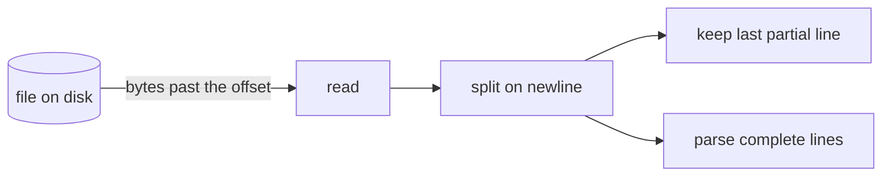
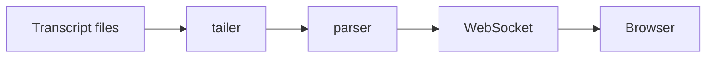

# AgentTrace record

AgentTrace reads a folder of Markdown files and turns them into a live, explained view of how a
project was built. It uses no language model of its own. Everything it can explain, it explains
because you wrote it down here, in the same turn as the code, in the format below.

Write for a reader who does not program. Short sentences. Name the thing, say what it does, say
why it is here, say what it replaced. Then, and only then, the mechanism.

## Where the record lives

The project's record root is named in `agenttrace.json` at the root of the project repo:

```json
{ "contract": 1, "project": "AgentTrace", "record": "e:/Work/Live/code/Project/docs/AgentTrace" }
```

**If `agenttrace.json` is missing, stop and ask the owner for a path. This is a hard stop, not a
preference.** Write nothing — not a folder, not a first lesson, not a placeholder — until they
have answered. Choosing on their behalf is what put a record inside somebody's own documentation
and got it deleted; see the ownership rule below.

Ask it plainly, in one question, and say why it is being asked:

> Where should this project's learning record live? It needs a folder of its own that nothing
> else writes to — not inside a folder where you keep your own notes or documentation, because
> a later tidy-up of those would take the record with them. A path like
> `<somewhere you keep private notes>/agenttrace-record/<Project>/` works well. What should it be?

Then, before writing anything to the answer:

1. **Check it is unclaimed.** List the path and every parent up to the repository or drive root.
   If any of them holds a file this contract did not write, say so, explain that a cleanup of
   that folder would take the record, and ask for a different path. Do not proceed on a folder
   somebody else is using, however convenient it looks.
2. **Confirm it back.** Name the exact absolute path and say plainly: everything the record
   writes goes here and nowhere else, and this folder is now the owner's to keep — if it is
   moved or deleted, the record goes with it.
3. **Record that they chose it.** Write the path into `agenttrace.json` together with
   `chosen_by: owner` and the date. That line is the audit trail: it says the location was
   answered for, not assumed.

```json
{
  "contract": 1,
  "project": "HRMS",
  "record": "e:/Work/Live/code/Project/docs/agenttrace-record/HRMS",
  "library": "e:/Work/Live/code/Project/docs/agenttrace-record/library",
  "chosen_by": "owner",
  "chosen_at": "2026-09-11"
}
```

**Keep asking until they decide.** One question that goes unanswered is not a decision, and it
must not become a default by exhaustion. While `agenttrace.json` is missing, ask again at the
end of **every** response in that repository — briefly after the first time, one line, not the
full question again:

> Still no record path for this project. Say where it should live and the record starts from the
> next turn; everything before it goes unrecorded.

Ask on every prompt, for as long as it takes, including across sessions. Do not stop after three
attempts, do not decide it must not be wanted, and do not quietly proceed — a session that stops
asking has chosen "no record" on the owner's behalf, which is the same fault as choosing a path
on their behalf.

Two answers end it. A path ends it, and the record starts. **"No record for this project" also
ends it** — write `{"contract": 1, "project": "<Name>", "record": null, "declined_at": "<date>"}`
and never ask again for that repository unless the owner reopens it. Silence is not that answer.

Never guess, and never fall back to a default. Work not recorded while the question is open is
lost to the record, and that is the correct price: it costs notes. Guessing costs the whole
record, later, silently.

**The record root is a folder the record owns completely.** This is the rule the other two
depend on, and it is the one that has actually failed in practice. A record was once placed at
`docs/HRMS/agenttrace/`, a subfolder of the folder where the owner kept their own HRMS
documentation. The name did not clash, so the clash rule below was satisfied. Months later the
owner asked a session to clean up the HRMS docs, and the whole record went with them —
forty-one files, including every lesson and every decision.

So: **never put the record inside a folder that holds documents somebody else authored, at any
depth.** Being in a subfolder is not protection; a cleanup, a move or a reorganisation of the
parent takes the child. Before choosing a root, list the candidate folder and its parents up to
the repository root. If any of them holds a file this contract did not write, the candidate is
not a record root. Go up to a level nobody has claimed and make a dedicated folder there —
`agenttrace-record/<Project>/` — so a person tidying their own notes for that project never has
the record in the blast radius.

The owner is not prevented from cleaning up their own documentation, and must not be. The record
simply has to be somewhere that is not part of what they are cleaning.

The record folder belongs to this contract and to nothing else. Two more rules protect what the
owner already keeps:

- **Never touch a file the contract does not name.** Do not move, rename, merge, rewrite or
  delete the project's existing documents, wherever they are, and do not copy them into the
  record. The record may cite them by path.
- **Names clash across letter case.** Windows and macOS treat `ROADMAP.md` and `roadmap.md` as
  one file. Before the first write, list the chosen folder. If it already holds any file or
  folder whose name matches a record name ignoring case (`roadmap.md`, `stack.md`,
  `architecture.md`, `design.md`, `gaps.md`, `learning`, `decisions`, `journal`) that this
  contract did not write, **the folder is already somebody else's and is not a record root.**
  Do not burrow into a subfolder of it — that is what put a record inside the owner's own docs
  and got it deleted. Apply the ownership rule: go up to an unclaimed level, make
  `agenttrace-record/<Project>/` there, name it in `agenttrace.json`, and say so. Never
  overwrite, and never share a parent with documents somebody else maintains.

Then register it, so the app can still find the record if this folder is later moved or deleted:

    node ~/.claude/skills/agenttrace/register.mjs

from the repository root (`%USERPROFILE%\.claude\skills\agenttrace\register.mjs` on Windows; honour
`CLAUDE_CONFIG_DIR` when it is set). It writes one entry to `agenttrace/repos.json` beside the
coding tool's own files and prints what it registered. Run it again whenever the manifest changes.

Every path below is relative to `record`.

```
<record>/
  roadmap.md            milestones and their gates
  stack.md              every technology in use, with why and what was rejected
  architecture.md       components, how they connect, one diagram
  design.md             visual and interaction design choices (only for projects with a UI)
  gaps.md               known problems, never deleted, marked fixed in place
  learning/<slug>.md    one concept per file: the teaching material
  decisions/<slug>.md   one decision per file, ADR style
  journal/<date>.md     one entry per working session
```

Slugs are lowercase, hyphenated, unique within their folder. Check the folder before writing so a
concept gets one file, not two. If the concept already has a file, update it and bump `updated`.

## Alongside documentation the project already keeps

Many projects already have a documentation habit: an instruction file that names documents to
write, a `docs/` folder with its own pattern, an ADR directory, a dated status log. That habit
continues unchanged. The record is written in addition to it, never instead of it, and never
merged with it.

- Keep following the project's own instructions for its own documents. If they say to update
  `ARCHITECTURE.md` in `docs/`, update it there as before; then update the record's
  `architecture.md` as well. Two documents, two purposes: theirs is for the project, the record
  is for the reader of AgentTrace.
- When the two would say the same thing, the record cites the project's document by path and
  adds what the contract asks for (the plain-language explanation, the diagram, the anchor into
  the code) rather than duplicating it.
- An instruction elsewhere that names a document with the same name as a record file refers to
  the project's document, not the record's. The record's files are only ever the ones under the
  path in `agenttrace.json`.

## When to write what

| Moment | Write |
|---|---|
| A dependency is added, a config file for a tool appears, a new language or runtime is used | `stack.md` row, plus a `learning/` entry of type `library` or `tool` |
| A pattern is introduced (streaming a file, a state store, an event bus, virtualization) | `learning/` entry of type `pattern` |
| An algorithm or data structure is written by hand | `learning/` entry of type `algorithm`, with the steps written out |
| Math appears (a formula, a rate, a probability, a scoring rule) | `learning/` entry of type `math`, formula plus a worked example with real numbers |
| A component is created, split, merged or removed | `architecture.md` components list and diagram |
| A choice is made between two or more viable options | `decisions/` entry |
| A visual or interaction choice is made (layout, typography, color, motion) | `design.md` section, and a `learning/` entry of type `design` if the choice teaches something |
| A security or correctness boundary is set (validation, path checks, limits) | `learning/` entry of type `security` or `testing` |
| A problem is found and left unfixed | `gaps.md` row |
| A milestone gate is passed | `roadmap.md` status |
| The session ends, or the user says stop | `journal/<date>.md` |

Write the entry in the same turn as the code it describes. Do not batch to the end.

## learning/<slug>.md

A learning entry is a lesson, not a note. It opens on the reader's own code, shows the idea as a
picture, walks the mechanism in steps, asks the reader to commit to an answer before seeing it,
and ends with something to try. Aim for the length of a good tutorial page, not a paragraph.

```markdown
---
title: Tailing a file by byte offset
summary: Read only the bytes added since last time, so a growing file is never re-read
type: pattern
level: beginner
tags: [filesystem, streaming, chokidar]
files: [server/src/tail.ts]
anchor: onChange
prerequisites: [jsonl, line-by-line-file-reading]
related: [chokidar]
date: 2026-09-03T10:42:00+05:30
updated: 2026-09-03T10:42:00+05:30
session: 2700d89b-d5b8-44bd-bf70-c7673b150d57
questions:
  - q: The file is 1,000 bytes and the offset says 1,000. A change event fires and the file is 1,200 bytes. How many bytes are read?
    a: 200. Only the bytes past the offset. The offset then becomes 1,200.
  - q: The file shrinks to 300 bytes. What must the tailer do, and why?
    a: Reset the offset to zero and drop any partial line. A smaller file means it was replaced, so nothing already read can be trusted to still be there.
exercise:
  task: In a scratch folder, write a 20-line script that prints new lines of a file as they are appended, using only fs.statSync and fs.readSync.
  hint: Keep two variables between polls, the byte offset and the partial line without a newline yet.
  solution: |
    let offset = 0, partial = '';
    setInterval(() => {
      const size = fs.statSync(file).size;
      if (size < offset) { offset = 0; partial = ''; }
      if (size === offset) return;
      const buf = Buffer.alloc(size - offset);
      const fd = fs.openSync(file, 'r'); fs.readSync(fd, buf, 0, buf.length, offset); fs.closeSync(fd);
      offset = size;
      const lines = (partial + buf.toString()).split('
');
      partial = lines.pop() ?? '';
      lines.forEach((l) => console.log(l));
    }, 200);
---
## What it is

Two or three short paragraphs a non-programmer can follow. Say what the thing is, what it
replaces, and the one sentence that makes it click.

## Why here

The reason this project needs it, and what simpler thing would have failed. Name the cost.

## The idea in one picture



One sentence under the picture saying what to look at.

## How it works

1. Numbered steps, one action each, in the order the code does them.
2. For an algorithm, the steps are the algorithm.
3. For math, the formula, then one worked example with real numbers from this project.

## Where to look

File names and function names, so the reader can open the code. The app shows the lines
around `anchor` from the first file in `files` automatically; say what to notice in them.

## Go deeper

One or two links, or a book chapter, each with a line on why.
```

Fields:
- `type`: one of `library`, `tool`, `pattern`, `algorithm`, `math`, `architecture`, `design`,
  `security`, `testing`, `term`.
- `level`: `beginner`, `intermediate`, `advanced`. Judge for a reader who does not program.
- `summary`: one sentence, shown on cards. No trailing period needed.
- `tags`: lowercase words. Reuse tags already present in the folder.
- `files`: paths relative to the project repo. The first one is the lesson's code sample.
- `anchor`: a function, class, variable or exact phrase in the first file. The app shows the
  lines around its first occurrence. Omit only when the whole file is short.
- `prerequisites` and `related`: slugs of other entries. A prerequisite that has no file yet is
  a request to write it.
- `questions`: two to four. Each `q` is answerable from the lesson; each `a` says why, in one
  or two sentences. The reader commits to an answer before revealing yours.
- `exercise`: one `task` the reader can do in ten minutes with what is on this machine, one
  `hint`, one `solution`. The solution is real, runnable text, not a description.
- `date`: when first written. `updated`: when last changed. ISO 8601 with offset.
- `session`: the id of the session that wrote the entry. Read it with
  `echo $CLAUDE_CODE_SESSION_ID` in a Bash call; it is set in every session.

Body headings are exactly `## What it is`, `## Why here`, `## The idea in one picture`,
`## How it works`, `## Where to look`, `## Go deeper`. The app renders them as sections with a
table of contents. A `mermaid` fence draws a diagram; a code fence with a language name is
highlighted. Plain bullet and numbered lists, bold, inline code and links render; no HTML.

A `term` entry may stop after `## What it is` and `## Why here`, with one question and no
exercise. Everything else gets the full shape.

## decisions/<slug>.md

```markdown
---
title: No database; the transcript files are the source of truth
status: accepted
date: 2026-09-03T09:10:00+05:30
tags: [storage, architecture]
files: [server/src/discover.ts]
supersedes:
session: 2700d89b-d5b8-44bd-bf70-c7673b150d57
---
**Context.** What was true and what forced a choice.

**Options.** Each option in one line, with its cost.

**Decision.** The option taken.

**Why.** The reasons, in order of weight.

**Consequences.** What becomes easier, what becomes harder, what to revisit and when.
```

`status` is `accepted` or `superseded`. When superseding, write a new file, set `supersedes` to
the old slug, and set the old file's `status` to `superseded`. Never delete a decision.

## journal/<date>.md

One file per working session, named by local date and start time: `2026-09-03-1042.md`.

```markdown
---
date: 2026-09-03
started: 2026-09-03T10:42:00+05:30
ended: 2026-09-03T13:05:00+05:30
milestone: M0
summary: Skill written, workspaces scaffolded, parser passing fixtures.
learning: [byte-offset-tailing, chokidar, npm-workspaces]
decisions: [no-database]
commits: [a1b2c3d, e4f5a6b]
next: [Session list endpoint, tail.ts with offset map]
session: 2700d89b-d5b8-44bd-bf70-c7673b150d57
---
**Done.** What changed, in the order it happened.

**Learned.** The concepts introduced, one line each, linking the slugs above.

**Open.** What is unfinished, and any gap added to `gaps.md`.

**Next.** The first three things the next session should do.
```

`commits` are short hashes made during the session, in order. Leave the list empty when nothing
was committed. `milestone` names the roadmap milestone the session mostly served.

## roadmap.md

```markdown
---
project: AgentTrace
updated: 2026-09-03T10:42:00+05:30
milestones:
  - id: M0
    title: Skill, scaffold, parser, session list
    status: in-progress
    gate: Current 25MB session opens under 3s; event counts match grep on record types.
  - id: M1
    title: Live timeline
    status: planned
    gate: Tool calls from a second session appear within 1s of landing on disk.
---
**Positioning.** What the project is, for whom, and what it is not. Three sentences.

**Milestones.** One paragraph per milestone: what it delivers and why it comes at this point.
```

`status` is `planned`, `in-progress`, `done`, or `dropped`. Change it in place; the git history
of this file is the record.

## stack.md

```markdown
---
project: AgentTrace
updated: 2026-09-03T10:42:00+05:30
stack:
  - name: chokidar
    category: filesystem
    version: "4.0.3"
    why: Cross-platform file watching that copes with Windows path quirks and editor rename dances.
    instead_of: fs.watch alone, which misses events on Windows and fires duplicates.
    learning: chokidar
---
**Overview.** The stack in three sentences: language, runtime, front end, storage, and the one
thing that makes this stack unusual for this project.
```

`category` is one of `language`, `runtime`, `framework`, `ui`, `storage`, `filesystem`,
`network`, `build`, `test`, `lint`, `deploy`, `other`. `learning` is the slug of the entry that
explains it; write that entry in the same turn.

## architecture.md

```markdown
---
project: AgentTrace
updated: 2026-09-03T10:42:00+05:30
components:
  - name: tailer
    path: server/src/tail.ts
    role: Watches transcript files and pushes new lines to the broadcaster.
    depends_on: [parser]
  - name: parser
    path: server/src/parse.ts
    role: Turns one JSONL line into typed events.
    depends_on: []
---
**Shape.** The system in one paragraph: what comes in, what goes out, what sits in the middle.



**Boundaries.** For each component: what it owns, what it must never do, how it is tested.

**Flow of one event.** Follow one real event from disk to screen, naming each function.
```

Keep the `components` list and the diagram in step. When a component appears, both change.

## design.md

Only for projects with a user interface.

```markdown
---
project: AgentTrace
updated: 2026-09-03T10:42:00+05:30
principles:
  - Explanation before code. A card opens on the plain-language line, not on JSON.
  - Follow-tail is a mode the reader chooses, never a surprise scroll.
tokens:
  font_body: Inter
  font_code: JetBrains Mono
  color_bg: "#0f1115"
  color_accent: "#4f8cff"
---
**Layout.** Why the screen is arranged this way, and what was tried and dropped.

**Typography and color.** The choices and the reason for each. Name the alternative rejected.

**Motion.** What moves, why, and what deliberately does not.

**Opinions.** The taste calls: things that are not measurable but were chosen on purpose.
```

## gaps.md

```markdown
---
project: AgentTrace
updated: 2026-09-03T10:42:00+05:30
gaps:
  - id: G1
    title: Tailer misses a file created and written within the same 50ms
    severity: medium
    status: open
    found: 2026-09-03
    fixed:
    files: [server/src/tail.ts]
---
**G1.** How it shows, how to reproduce, what the fix would take.
```

`severity` is `low`, `medium`, `high`. `status` is `open` or `fixed`. Never delete a gap; set
`status: fixed` and `fixed:` date, and add one line under the heading saying what changed.

## Backfill: a repository that existed before the record

A repository built before this skill was in use has history but no record. Backfill writes the
record from that history. Trigger: the owner asks for it (`/agenttrace backfill`, "backfill the
record", "write the record for this repo") in a session inside the repository.

Nothing in a backfilled record may be invented. Each document has evidence it needs, named in
the table below; when that evidence is missing, the document is not written, and `gaps.md` says
what is missing and why the document is absent. A record with three honest files is worth more
than one with eight guessed ones.

1. **Manifest and registration.** As above: if `agenttrace.json` is missing, ask where the
   record should live, apply the clash rule, write the manifest, register it. The project's
   existing documents stay exactly where and as they are.
2. **Get the dossier.** With the app running, fetch it into the scratch folder and read it:

       curl -s "http://127.0.0.1:4747/api/dossier?cwd=<absolute repository root>" -o <scratch>/dossier.md

   It opens with the evidence that exists (sessions, commits and their date span, tags,
   documents already in the repository, decision records, a dated status log, commits whose
   message states a reason) and what that allows per record document. Then it lists every
   archived session that worked in the repository (date, title, files written, helpers used,
   commits made during it), every technology seen with its first appearance and evidence, every
   commit on the default branch with the session it belongs to, the commit messages that state
   a reason, and what the record already holds. The documents it lists come from the
   repository and from the folder the record sits in (its parent, when the record is an
   `agenttrace` subfolder), so notes kept outside the repository count as evidence too. A
   line saying that commits before some date have no archived session means the tool removed
   those transcripts before they were indexed: that month has commits and documents only, and
   `gaps.md` says so. If the app is not running, say so, continue with git and the working
   copy only, and note in `gaps.md` that the session history was not available.
3. **Decide per document from the evidence.** Read the real files before writing each; one
   document per turn.

   | Document | Evidence it needs | When the evidence is missing |
   |---|---|---|
   | `stack.md` | the working copy: manifests, imports, config files | always writable; the why says "reason not recorded" unless a README, commit message or session states it |
   | `architecture.md` | the working copy: folders, entry points, how they call each other | always writable, as the code is now, not as it was planned |
   | `learning/` | the working copy, one concept at a time, anchored in a real file | always writable; "Why here" says "reason not recorded" unless a source states it |
   | `roadmap.md` | a sequence: tags, releases, dated commits, session titles, or an existing roadmap or status log | one commit and no documents: write the positioning from the README and a single milestone "as found on <date>", status done, and say the order of work is unknown |
   | `decisions/` | a stated reason: an existing ADR, a commit message that says why, a README section that argues a choice, a session that weighed options | no stated reason anywhere: write no decision; list the choices whose reason is unknown in `gaps.md` |
   | `journal/` | archived sessions, or a dated status log the project already keeps | neither: write no journal; `gaps.md` says the history before the record is not on this machine |
   | `design.md` | a UI in the working copy | no UI: not written |
   | `gaps.md` | nothing; always written | states, per document above, what was and was not reconstructible, and every choice with no recorded reason |

   The cases this covers, richest first:
   - **Sessions, commits and documents all present.** Everything is writable; the journal has one
     entry per session; decisions come from the documents, the commit messages and the sessions.
   - **Commits with history, no sessions.** No journal; roadmap from tags and dated commits;
     decisions only from commits and documents that state a reason.
   - **Documents but a flat history.** Roadmap and decisions cite the documents; no journal.
   - **One commit, no documents, no sessions** (an archived project). `stack.md`,
     `architecture.md`, `learning/`, `gaps.md`, and a one-milestone `roadmap.md`. Nothing else,
     and `gaps.md` says why.
4. **Mark every reconstruction.** Each backfilled file carries `reconstructed: true` and a
   `source:` line naming what it was written from (a path, a commit, a session id) in its
   frontmatter, with `date` set to the date of the history it describes. A reader can then tell
   a reconstruction from a record kept at the time. A lesson written from the working copy alone
   carries `reconstructed: true` without a source.
5. **Stop and report** what was written, what was not, and why, in one short list.

## Rules

- Same turn as the code. An entry written later loses the reasoning that was live at the time.
- One concept, one file. Search the folder for the slug and for the title words before creating.
- Frontmatter must parse as YAML. Quote strings that contain colons. Dates carry a timezone.
- Never write a model name, an assistant name, or any phrasing implying the record had a
  non-human author. The record reads as the project owner's own notes.
- The `session:` field is the exception, and it is required. A session id is a join key naming a
  file already on this machine, not attribution: it says nothing about which model ran, or that
  one ran at all. AgentTrace uses it to link an entry to the turn that produced it.
- Never invent a "why" you do not have. If the reason is "the user asked for it", write that.
- Keep `updated` on the single-file documents current. AgentTrace uses it to know what changed.
